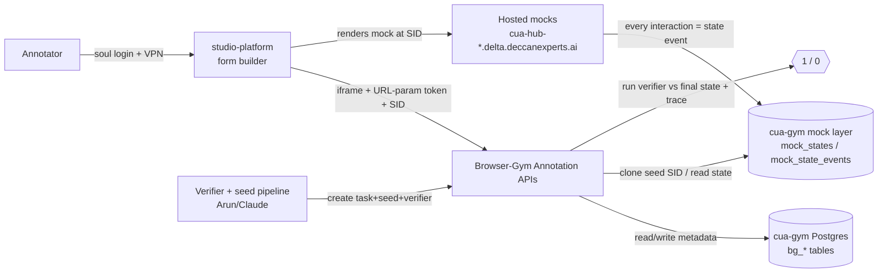
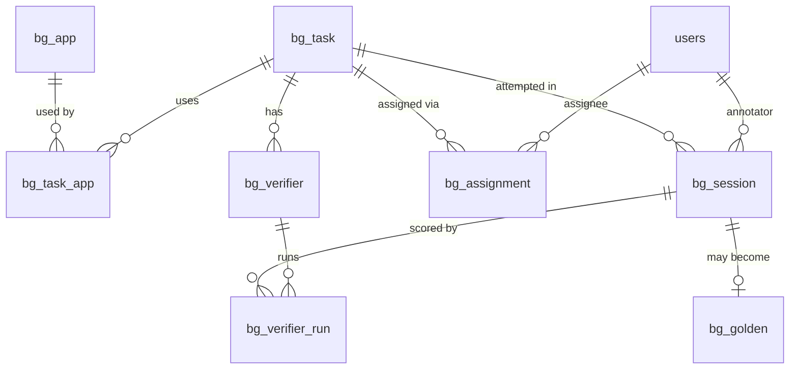

# Browser Gym Annotation Platform — Low-Level Design (LLD)

**Owner:** Dhiren · **Reviewers:** Kashyap (HLD), Aarunik, Shravan
**Status:** Draft v0.1 (for Kashyap review) · **Date:** 2026-07-29
**Scope:** Phase 1 — JSON state + static seed data, target ≥500 samples, Tencent 20-task cut by Monday.

> This LLD covers **only the browser-gym annotation platform's own DB + APIs** — the tables and
> contracts we add so a task, its seed, its allowed sites and its verifier can be rendered and
> scored inside the studio-platform iframe. It **reuses** the existing `cua-gym` mock layer
> (`mock_state_events`, `mock_states`, `mock_files`, `users`) as-is; we do **not** rebuild auth,
> the form-builder UI, or the mock state engine (Kashyap owns those).

---

## 1. Context & decisions this design honors

- **Host:** the existing **studio-platform** (form-builder + iframe). Auth (soul ID / OAuth) is done by
  Kashyap and passed into the iframe via URL-param access/refresh tokens. We do not build auth.
- **JSON for Phase 1** (Ankit's ruling): mock *state* stays JSON in `cua-gym`. Our new tables are thin
  relational **metadata** (task, seed refs, verifier, session) — the small "additional tables in the
  staging DB" Kashyap asked for. No relational base-seed DB yet (that's the Phase-2 versioning topic).
- **Static, frozen seed data** — no dynamic generation (dynamic data breaks verifiers).
- **Verifier** is **pipeline-generated (Arun/Claude) then human-corrected**; the annotator's run is
  scored **1/0** against it. We store + run it; we do not author it in the UI.
- **Session isolation:** each attempt runs on an **ephemeral SID cloned from the task's seed**, wiped
  after a configurable **60–90 min** TTL.
- **New tab:** allowed apps can open in a new tab (client validates each app/DB in isolation).
- **Client delivery:** export a **tar** per task (code + prompt + verifier + initial & final state + trace).
- **Deferred (out of scope):** reCAPTCHA/WebArena logic, dynamic data, cross-DB relational base.

---

## 2. Architecture at a glance

**One-line flow:** pipeline creates *task + seed + verifier* → annotator opens the task in the
studio-platform → we mint an **attempt SID cloned from the seed** → the mock renders at that SID →
interactions log to `mock_state_events` → on submit we run the stored verifier against the final
state + event trace → **1/0**. Golden attempts are packaged as a tar for the client.

---

## 3. Existing `cua-gym` layer we reuse (do NOT rebuild)

From the live DB (`souldb › cua-gym › public`). Columns marked *(assumed)* need Kashyap/Ganesh to confirm.

| Table | Rows | Key columns | Role |
|---|---|---|---|
| `mock_state_events` | ~96K | `mock` text, `sid` uuid, `action` text (`set`/`set_current`/…), `state` jsonb, `created_at` timestamptz | **Append-only event log** — every interaction on a mock under a SID. This is the trace. |
| `mock_states` | ~80K | `mock`, `sid`, `state` jsonb, `updated_at` *(assumed)* | **Current/materialized state** per (mock, SID). |
| `mock_files` | ~64K | `id`, `mock`, `sid`?, `filename`, `mime`, `ref/url` *(assumed)* | File **metadata** for mocks (files are not stored, only metadata). |
| `users` | — | `id`/`soul_id`, `email`, `name`, `status` *(assumed)* | Platform users (soul IDs). Our FKs point here for the annotator. |

**Key fact:** `sid` is the pivot. A `(mock, sid)` pair fully addresses one mock's state. A task's
seed is a set of `(mock, seed_sid)`; an attempt is a set of `(mock, attempt_sid)` cloned from it.

---

## 4. New tables — the browser-gym annotation layer (`bg_*`)

All in the `cua-gym` DB (prefix `bg_` to namespace against `mock_*`). Postgres.

### 4.1 `bg_app` — registry of hosted mocks
| Column | Type | Notes |
|---|---|---|
| `id` | serial PK | |
| `key` | text unique | matches `mock_state_events.mock`, e.g. `gmail_mock`, `amazon_mock`, `google_calendar_mock`, `ubereats_mock`, `ebay_mock` |
| `display_name` | text | "Amazon", "Gmail" … |
| `base_url` | text | e.g. `https://cua-hub-amazon.delta.deccanexperts.ai` |
| `opens_in_new_tab` | bool | default true |
| `active` | bool | |

### 4.2 `bg_task` — the task definition (created by the pipeline)
| Column | Type | Notes |
|---|---|---|
| `id` | uuid PK | |
| `task_key` | text unique | human id, e.g. `amazon.return_order.001` |
| `instruction` | text | the prompt shown to the annotator |
| `allowed_sites` | jsonb | array of `bg_app.key` the task may use |
| `difficulty` | text | easy/medium/hard |
| `failure_mode` | text | one primary mode (13-mode taxonomy / vein), nullable for happy-path |
| `skill_tags` | jsonb | `["navigation","form_fill","state_change",…]` |
| `expected_behavior` | text | what a correct agent/annotator should do (incl. infeasible/stop cases) |
| `source` | text | `pipeline` \| `manual` |
| `status` | text | `draft` \| `ready` \| `archived` |
| `created_by` | text | soul_id / pipeline id |
| `created_at` | timestamptz | |

### 4.3 `bg_task_app` — task ↔ mock + **seed SID** (the frozen initial state)
| Column | Type | Notes |
|---|---|---|
| `id` | serial PK | |
| `task_id` | uuid FK→`bg_task` | |
| `app_key` | text FK→`bg_app.key` | |
| `seed_sid` | uuid | the SID whose `mock_states`/`mock_state_events` hold the **frozen seed** for this app |
| `role` | text | `primary` \| `secondary` |
| `start_url` | text | deep link into the mock (e.g. `/account/orders`) |
| UNIQUE | | (`task_id`, `app_key`) |

### 4.4 `bg_session` — an annotation attempt (ephemeral, isolated)
| Column | Type | Notes |
|---|---|---|
| `id` | uuid PK | our session id |
| `task_id` | uuid FK→`bg_task` | |
| `annotator_id` | text FK→`users` | soul_id |
| `status` | text | `active` \| `submitted` \| `approved` \| `rejected` \| `expired` |
| `apps` | jsonb | `[{app_key, attempt_sid, start_url}]` — the cloned SIDs for this attempt |
| `started_at` | timestamptz | |
| `expires_at` | timestamptz | `started_at + ttl` (config 60–90 min) |
| `score` | int | last verifier score (1/0), null until run |
| `is_golden` | bool | promoted as the golden trajectory |

> **attempt_sid** is minted per app by cloning `bg_task_app.seed_sid`'s state into a fresh SID (§6).
> On expiry, a cleanup job drops all `mock_state*` rows for the attempt SIDs (§6.4).

### 4.5 `bg_verifier` — the deterministic verifier (pipeline → human-corrected)
| Column | Type | Notes |
|---|---|---|
| `id` | uuid PK | |
| `task_id` | uuid FK→`bg_task` | |
| `spec` | jsonb | verifier definition: positive asserts + **forbidden-mutation** asserts, the state keys to diff, expected values |
| `type` | text | `deterministic` \| `llm` (Phase-1 deterministic) |
| `version` | int | |
| `status` | text | `pipeline_generated` \| `human_reviewed` \| `approved` |
| `reviewed_by` | text | annotator/soul_id who corrected it |
| `created_at` | timestamptz | |

### 4.6 `bg_verifier_run` — a scoring result
| Column | Type | Notes |
|---|---|---|
| `id` | uuid PK | |
| `session_id` | uuid FK→`bg_session` | |
| `verifier_id` | uuid FK→`bg_verifier` | |
| `score` | int | 1 / 0 |
| `passed` | bool | |
| `details` | jsonb | per-assertion pass/fail (incl. which forbidden mutation fired) |
| `run_at` | timestamptz | |

### 4.7 `bg_assignment` — who should do which task
| Column | Type | Notes |
|---|---|---|
| `id` | serial PK | |
| `task_id` | uuid FK→`bg_task` | |
| `annotator_id` | text FK→`users` | |
| `status` | text | `assigned` \| `started` \| `done` |
| `assigned_at` | timestamptz | |

### 4.8 `bg_golden` — the approved golden output (for packaging)
| Column | Type | Notes |
|---|---|---|
| `id` | uuid PK | |
| `task_id` | uuid FK→`bg_task` unique | one golden per task (Phase 1) |
| `session_id` | uuid FK→`bg_session` | the approved attempt |
| `verifier_id` | uuid FK→`bg_verifier` | |
| `packaged_at` | timestamptz | |
| `tar_ref` | text | object-store ref of the exported bundle |

---

## 5. API contracts

Base path `/api/bg`. All calls are inside the studio-platform iframe; auth = the soul token passed by
URL param (validated per request). All behind the soul VPN.

### 5.1 Task management (pipeline + admin)
| Method · Path | Purpose | Request → Response |
|---|---|---|
| `POST /tasks` | pipeline creates a task | `{task_key, instruction, allowed_sites[], apps:[{app_key, seed_sid, start_url, role}], verifier:{spec,type}, difficulty, failure_mode, skill_tags, expected_behavior}` → `{task_id}` |
| `GET /tasks` | inventory / assignment list | `?status&app&difficulty` → `[{task_id, task_key, instruction, allowed_sites, status}]` |
| `GET /tasks/{id}` | task detail for rendering | → `{task_id, instruction, allowed_sites, apps:[{app_key, start_url}], difficulty, failure_mode}` |
| `GET /apps` | mock registry | → `[{key, display_name, base_url, opens_in_new_tab}]` |

### 5.2 Session lifecycle (the core annotation flow)
| Method · Path | Purpose | Request → Response |
|---|---|---|
| `POST /sessions` | **start an attempt** — clone seed → attempt SIDs | `{task_id, annotator_id}` → `{session_id, task:{instruction, allowed_sites}, apps:[{app_key, attempt_sid, url}], expires_at}` |
| `GET /sessions/{id}` | resume / render | → `{session_id, status, apps:[{app_key, attempt_sid, url}], expires_at, score}` |
| `POST /sessions/{id}/heartbeat` | extend TTL while active | → `{expires_at}` |
| `POST /sessions/{id}/submit` | annotator done → triggers verify | → `{verifier_run}` (see 5.3) |
| `DELETE /sessions/{id}` | abandon → wipe attempt SIDs | → `204` |

> `POST /sessions` is the keystone API: it returns the **attempt_sid per app** that the iframe/mock uses
> to render the isolated seeded world.

### 5.3 Verifier
| Method · Path | Purpose | Request → Response |
|---|---|---|
| `POST /sessions/{id}/verify` | run stored verifier vs final state + trace | → `{score, passed, details}` |
| `GET /tasks/{id}/verifier` | fetch spec (for reviewer correction) | → `{verifier_id, spec, status, version}` |
| `PUT /tasks/{id}/verifier` | human-correct the verifier | `{spec}` → `{verifier_id, version, status:'human_reviewed'}` |

### 5.4 Golden + packaging
| Method · Path | Purpose | Request → Response |
|---|---|---|
| `POST /tasks/{id}/golden` | mark a session golden | `{session_id}` → `{golden_id}` |
| `POST /tasks/{id}/package` | export tar (code+prompt+verifier+initial+final+trace) | → `{tar_ref}` |

### 5.5 Mock state (read — from the cua-gym layer)
| Method · Path | Purpose |
|---|---|
| `GET /mocks/{app_key}/state?sid=` | current state (reads `mock_states`) |
| `GET /mocks/{app_key}/events?sid=` | full event trace (reads `mock_state_events`) |

*(If Kashyap already exposes mock state/events APIs, we call those instead of duplicating.)*

---

## 6. The SID / session-isolation model (base → clone → discard)

This is the rollback mechanism Aarunik described, realized on the JSON/SID layer.

1. **Seed (frozen, static).** The pipeline writes the task's initial state once, under a **`seed_sid`**
   per app (`bg_task_app.seed_sid` → rows in `mock_states`/`mock_state_events`). Never mutated.
2. **Clone on attempt.** `POST /sessions` mints a fresh **`attempt_sid`** per app and copies the seed
   state into it (one `mock_states` row + a `set` event per app). Recorded in `bg_session.apps`.
3. **Mutate in isolation.** The annotator works in the iframe/mock at `attempt_sid`; every interaction
   appends to `mock_state_events` under that SID. No other user's SID is touched.
4. **Discard.** On submit-approved (packaged) or on **TTL expiry (60–90 min)**, a cleanup job deletes
   the attempt SID's `mock_state*` rows. Seed SIDs and golden SIDs are retained.

> **Ownership question for Kashyap:** does the *clone* (step 2) happen in our API, or does the mock
> service clone when it first sees a new SID? Design assumes our API performs the copy; confirm.

---

## 7. Sequence flows

**A. Task creation (pipeline)**
`pipeline → POST /tasks` → insert `bg_task` + `bg_task_app`(seed_sid per app) + `bg_verifier`(spec). Task
becomes `ready` for assignment.

**B. Annotation attempt**
`annotator picks task → POST /sessions{task_id,annotator}` → clone seed_sid→attempt_sid per app, insert
`bg_session` (TTL) → iframe renders each mock at `base_url + start_url` with `attempt_sid` → interactions
log to `mock_state_events(attempt_sid)` → `POST /sessions/{id}/submit` → `POST .../verify` runs the
verifier vs the final `mock_states(attempt_sid)` + the event trace → **score 1/0** shown.

**C. Golden + package**
reviewer `POST /tasks/{id}/golden{session_id}` → `POST /tasks/{id}/package` → tar bundle (prompt +
verifier spec + seed state + final state + trace) → `tar_ref`.

**D. TTL cleanup**
cron/worker: for `bg_session` past `expires_at` and not golden → delete attempt-SID `mock_state*` rows,
set status `expired`.

---

## 8. How misfires are caught (the "ordered a MacBook too" case)

The verifier does **not** rely on final-state match alone. `bg_verifier.spec` carries **positive** asserts
("headphone order exists") **and** **forbidden-mutation** asserts ("no other order line created"). The run
reads both the final `mock_states` **and** the `mock_state_events` trace for the attempt SID, so an extra
order / auto-added warranty fires a forbidden assert → `score 0`. This is why the event trace (not just
final state) is stored.

---

## 9. Non-functionals

- **Auth:** none of our own — validate the soul token from the URL param; everything behind soul VPN.
- **Scale (Phase 1):** metadata tables are tiny; state stays JSON in `mock_state*`. Must stay clean to
  **≥500 samples** without schema change (Ankit's bar). Index `mock_state_events(mock, sid)` and
  `bg_session(status, expires_at)`.
- **Session TTL:** configurable 60–90 min; heartbeat extends; expiry wipes.
- **New-tab:** `bg_app.opens_in_new_tab`; the iframe offers "open in new tab" per allowed app.

---

## 10. Seed migration (gym world → cua-gym `mock_states`)

The 20 pilot tasks' seed worlds come from the existing gym. Migrating a task's seed is a
**dump → transform → load** pipeline — implemented in the gym repo as `tools/seed_to_cuagym.py`.

1. **Dump** — `dataclasses.asdict(build_wrapped(task_id, seed))` gives the full per-app world
   (shop / mail / market / calendar / food) as plain dicts. (Also available live via
   `POST /_harness/reset` → `GET /_harness/world`.)
2. **Transform** — one function per app maps the gym shape → that mock's `mock_states` shape.
   The shapes differ, so this is real work; e.g. mail
   `{account_email, inbox/sent/drafts:{id:email}}` → gmail_mock
   `{user:{name,email}, emails:[{id, from, to:[{name,email}], cc, subject, body, folder…}]}`.
   The **mail transform is done**; shop / market / calendar / food are **stubbed pending each
   mock's schema**.
3. **Load** — mint a `seed_sid` per (task, mock); INSERT one `mock_states` row + an initial
   `set` `mock_state_events` row under it; record the `seed_sid` on `bg_task_app.seed_sid`.

app-key → mock: `shop→amazon_mock`, `mail→gmail_mock`, `market→ebay_mock`,
`calendar→google_calendar`, `food→uber_eats_mock`.

**Blocked pending (from Kashyap / Ganesh):** each mock's `mock_states` schema (to finish the four
transforms), the exact SID-load URL param, and cua-gym write access.

## 11. Golden-trajectory logging (pilot: annotator does the task, we log the steps)

The pilot has **no replay / review surface** — the annotator performs the whole task live in the
realistic UI and we capture their steps.

1. `POST /api/bg/sessions {task_id, annotator}` → clone each app's `seed_sid` into a fresh
   `attempt_sid`; return the mock URLs (`cua_hub.mock_url(app, start_path, attempt_sid)`).
2. The annotator works in the realistic UI; **every interaction is written by the mock to
   `mock_state_events` under the `attempt_sid`** — that event stream **is** the trajectory, so no
   separate capture is needed.
3. On submit, QC promotes the session to golden (`bg_golden`); the trajectory = the ordered
   `mock_state_events` for its `attempt_sid` + the initial/final `mock_states`.
4. `POST /api/bg/tasks/{id}/package` bundles prompt + verifier + initial & final state + the event
   trace as the tar for client delivery.

Multiple annotators may attempt one task (alternate correct paths); each is its own session /
`attempt_sid`. Phase 1 promotes **one** golden per task and retains the rest for QC.

## 12. Open questions for Kashyap / Ganesh (please confirm before build)

1. Exact columns of `mock_states`, `mock_files`, `users` (couldn't fully read from the grid).
2. Who owns the **seed→attempt SID clone** — our API or the mock service?
3. Is the seed stored as a normal SID in `mock_states`, or a separate "template" concept?
4. Do you already expose **mock state/events read APIs** we should call (vs §5.5)?
5. `soul_id` shape + how the studio-platform passes annotator identity into the iframe.
6. Should `bg_*` tables live in `cua-gym` (recommended, co-located) or a separate `annotation` DB?
7. Verifier `spec` schema — align with Arun's pipeline output format so `POST /tasks` ingests it directly.

---

## 13. Out of scope (Phase 1)

reCAPTCHA / WebArena logic · dynamic data generation · cross-app relational base seed DB
(Phase-2 versioning) · building auth or the form-builder UI · authoring verifiers in the UI.
